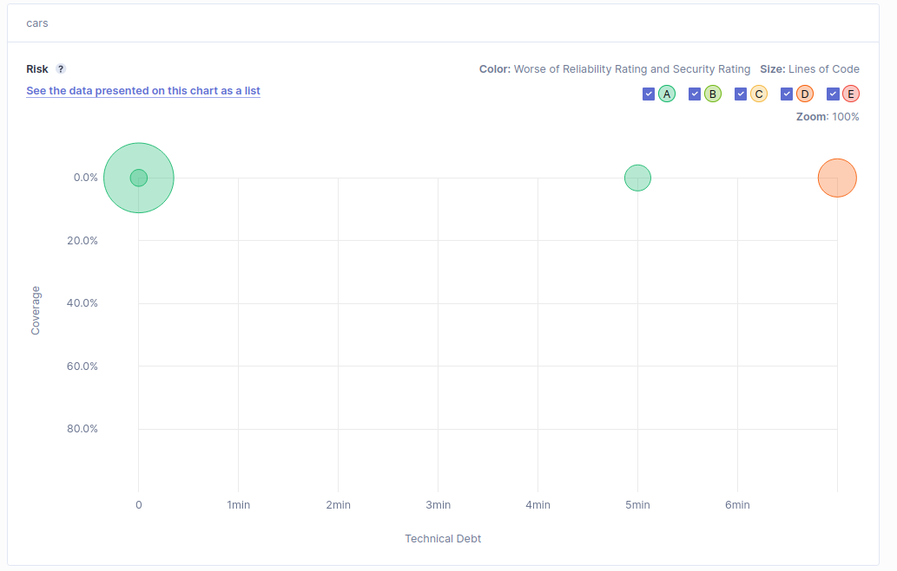

Technical debt: Technical debt is a metric that describes a metaphorical cost, which is added when developers take shortcuts in the process of software development. This cost is the time and effort that will be required in the future in order to fix or to refactor the code.

# C) Run the static analysis and discuss the coverage values on the SonarQube dashboard (how many lines are “not covered”? And how many conditions? Are the values good?...)

Coverage values: 74.2%
Lines to cover: 31

Most of the lines not covered are getters, setters and the default main method. All conditions of the code are covered, despite the bellow 80% coverage, the values are good.
